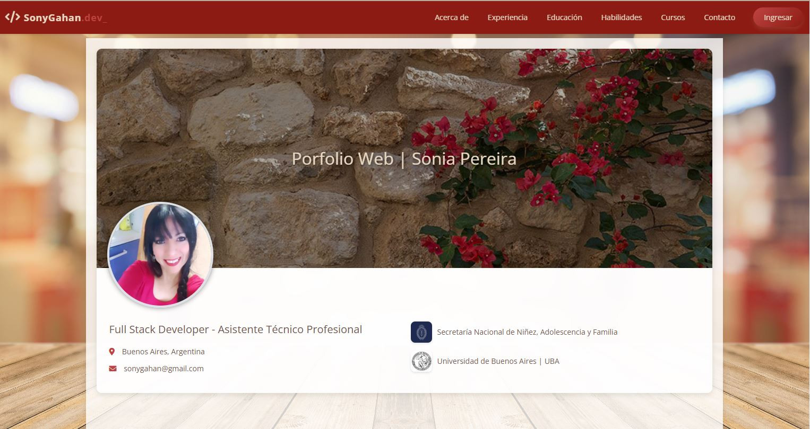
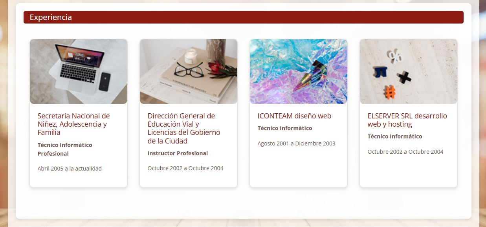
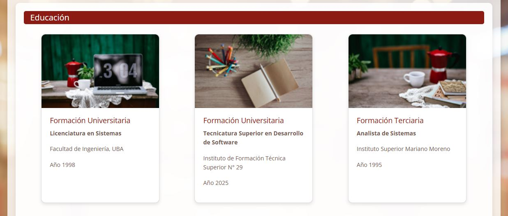
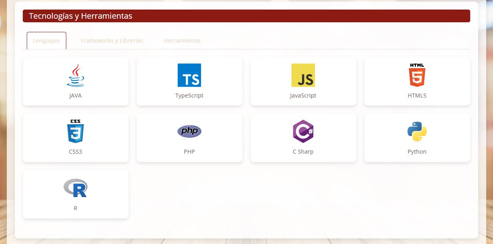

# 🚀 Portfolio Web Full Stack — Sonia Pereira

Bienvenido al repositorio de mi portfolio web profesional. Este proyecto es una aplicación web completa (Full Stack) diseñada para exhibir mi trayectoria académica, experiencia laboral, habilidades técnicas y certificaciones de manera dinámica, interactiva y segura.

El sistema cuenta con una arquitectura desacoplada, dividida en un Frontend estático de alto rendimiento, acompañado del repositorio del Backend que gestiona la persistencia de los datos y la seguridad de las operaciones administrativas.

---

## 🛠️ Tecnologías Utilizadas

### Interfaz de Usuario
* **HTML5 & CSS3:** Estructura semántica avanzada y diseño de estilos personalizado utilizando variables nativas (`:root`).
* **Bootstrap 5:** Maquetación responsiva para asegurar una visualización óptima en dispositivos móviles, tablets y monitores de escritorio.
* **JavaScript (Vanilla JS):** Manipulación dinámica del DOM y lógica de interactividad (efectos de scroll suave, animaciones de entrada fluidas y control de pestañas).
* **Font Awesome & Devicon:** Integración de isotipos vectoriales y de tecnologías modernas.
* **Microinteracciones Modernas:** El Frontend incluye estilos premium personalizados, como un logotipo interactivo que simula una terminal de comandos con un cursor parpadeante (`_`) y una grilla adaptativa con Flexbox que alinea milimétricamente las tarjetas de los cursos sin importar la extensión de sus títulos.

---

### 🏗  Ejecución del Frontend
Clone este repositorio localmente.

Abra el archivo index.html en su navegador o ejecútelo mediante un servidor local como Live Server en VS Code.

---

## 📷 Capturas de Pantalla

A continuación te mostramos cómo se ve el sitio web en diferentes pantallas:









---


## 💡 Contribuciones

Las contribuciones son bienvenidas. Si deseas mejorar el proyecto o agregar nuevas funcionalidades, sigue estos pasos:

1. **Haz un Fork** del repositorio.
2. Crea una nueva rama con una descripción clara:
   ```bash
   git checkout -b nueva-funcionalidad
   ```
3. Realiza tus cambios y haz un commit:
   ```bash
   git commit -m "Agrega nueva funcionalidad X"
   ```
4. Sube los cambios a tu repositorio remoto:
   ```bash
   git push origin nueva-funcionalidad
   ```
5. Crea un **Pull Request** en este repositorio.

---

## 📬 Contacto

Si tienes alguna duda o sugerencia, puedes contactarme a través de GitHub:

[GitHub: SonyGahan](https://github.com/SonyGahan)

---

## 📝 Licencia

Este proyecto está bajo la **Licencia MIT**. Consulta el archivo [LICENSE](LICENSE) para más detalles.

---

## 💻 Agradecimientos

🚀 Gracias por visitar mi repositorio y por tu interés en este proyecto. ¡Espero que te sea útil! 😄

## ✒️ Autor

⌨️ Construido con ❤️ por Sonia Pereira 😊